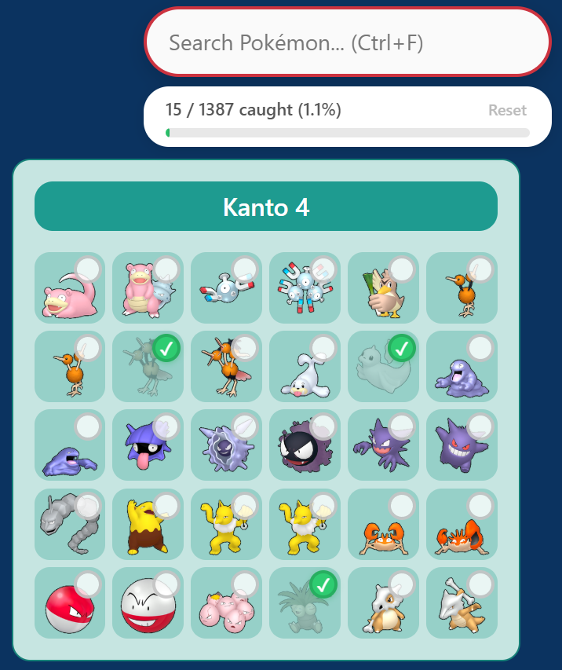

# PokéPC+ 🔴

A browser extension that adds a living dex tracker and Pokémon search to [pokepc.net](https://pokepc.net/livingdex). Works on Chrome and Opera (and probably other browsers.. idk I haven't tried tbh).

Open source - I'm not stealing your Pokémon.

---

## ✨ What it does

- 🔍 **Search** - find any Pokémon by name instantly. Jumps to them on the page, even if they haven't loaded yet.
- ✅ **Track catches** - click any Pokémon to mark it as caught. Caught ones grey out so you can see what's left at a glance.
- 📦 **Box shortcuts** - click a box heading to mark every Pokémon in that box at once. One click to catch 'em all (in that box at least) (I mean it should).
- 📊 **Progress bar** - shows how many you've caught out of the total, with a percentage. Great for convincing yourself you're almost done when you're not.
- 💾 **Persistent** - your progress is saved in browser storage and survives page refreshes. Closed the browser in panic? Still there.
- 🐛 **Bugs like crazy** - obviously this is a joke, but I wrote this with 2 fried neurons and AI so bugs are to be expected, report them or fix them and I'll pull 😊.

---

## 🚀 Installation

### Chrome

1. Download or clone this repo.
2. Go to `chrome://extensions`.
3. Enable **Developer mode** (toggle in the top right).
4. Click **Load unpacked** and select the project folder.
5. Navigate to `pokepc.net/livingdex` — the extension activates automatically.

### Opera

1. Download or clone this repo.
2. Go to `opera://extensions`. Yes, Opera is still a thing.
3. Enable **Developer mode** (toggle in the top right).
4. Click **Load unpacked** and select the project folder.
5. Navigate to `pokepc.net/livingdex` — the extension activates automatically.

---

## 🎮 How to use

| Action | How |
| --- | --- |
| Search for a Pokémon | Type in the search bar (top right), or press `Ctrl+F` |
| Jump between results | Click **Prev / Next**, or press `Enter` / `Shift+Enter` |
| Clear search | Press `Escape` |
| Mark a Pokémon as caught | Click it |
| Mark/unmark a whole box | Click the box heading |
| Reset all progress | Click **Reset** in the progress bar and confirm (no going back, choose wisely) |
